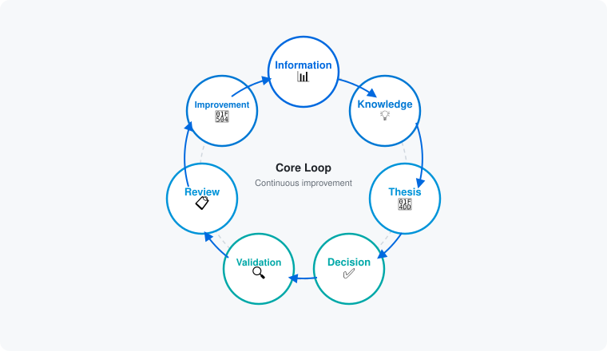
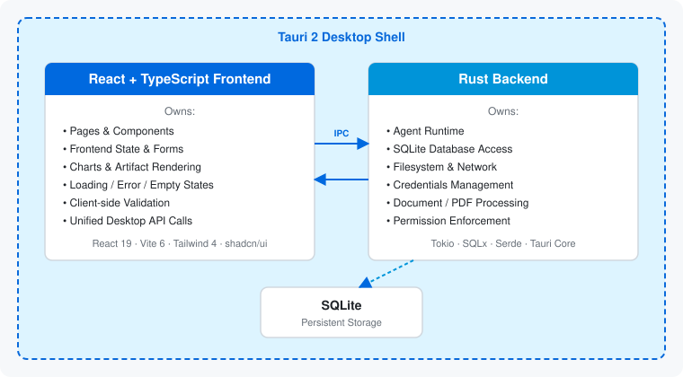
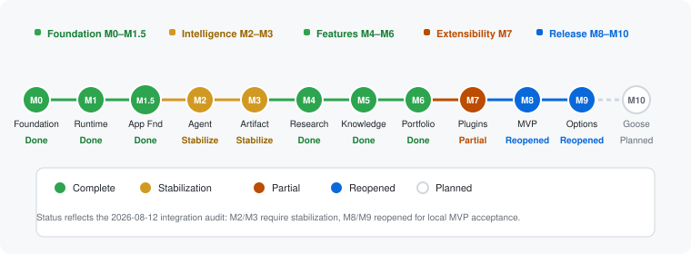

<picture>
  <source media="(prefers-color-scheme: dark)" srcset="assets/header-banner-dark.svg">
  
</picture>

<br>

[](https://www.gnu.org/licenses/agpl-3.0)
[](CONTRIBUTING.md)
[](CHANGELOG.md)
[](https://tauri.app)
[](https://www.rust-lang.org)
[](https://react.dev)

**Desktop-first AI workspace for investment research**

[English](README.md) | [简体中文](README-zh_CN.md) | [日本語](README-ja.md) | [한국어](README-ko.md) | [Español](README-es.md)

---

## What is AlphaForge?

AlphaForge is an **AI-native investment research workspace** designed to transform raw information into structured investment knowledge.

It is **not** a brokerage terminal — it does not execute trades or make autonomous investment decisions. Instead, it provides a structured research workflow that helps you gather information, build evidence-backed theses, make informed decisions, and validate outcomes over time.

### Core Product Loop

<picture>
  <source media="(prefers-color-scheme: dark)" srcset="assets/product-loop-dark.svg">
  
</picture>

AlphaForge helps you:

- **Research efficiently** — AI-assisted document analysis and information gathering
- **Build theses** — Track investment theses with evidence and confidence levels
- **Make informed decisions** — Structured research workflow, not chatbot-style interaction
- **Validate outcomes** — Track thesis performance and learn from results

> **Important**: This is a **research workspace**, not a brokerage terminal. It does NOT execute trades or make autonomous investment decisions.

---

## Table of Contents

- [Status](#status)
- [Features](#features)
- [Tech Stack](#tech-stack)
- [Getting Started](#getting-started)
- [Architecture](#architecture)
- [Documentation](#documentation)
- [Contributing](#contributing)
- [Roadmap](#roadmap)
- [Security](#security)
- [Current Limitations](#current-limitations)
- [License](#license)
- [Acknowledgments](#acknowledgments)

---

## Status

**Current program state (2026-08-15): stabilization required before local MVP acceptance.**

The 2026-08-12 audit found broken core integration paths. Merged repairs now include the isolated Artifact window (#88), Research URL context (#94), the controlled Option workflow (#95, #97, #98), and internal-plugin Settings (#99), with focused evidence; packaged smoke acceptance remains pending. The company-comparison create-to-Artifact slice is pending review. M8 and M9 remain reopened; M10 remains planned. See the [integration audit](docs/reviews/INTEGRATION_GAP_AUDIT_2026-08-12.md) and [stabilization roadmap](docs/STABILIZATION_ROADMAP.md).

| Milestone | Status | Description |
|-----------|--------|-------------|
| M0 | ✅ Complete | Project Foundation |
| M1 | ✅ Complete | Desktop Runtime Foundation |
| M1.5 | ✅ Complete | Application Foundation |
| M2 | ⚠️ Stabilization required | Agent Runtime |
| M3 | ⚠️ Stabilization required | Artifact Intelligence System |
| M4 | ✅ Complete | Research Workspace |
| M5 | ✅ Complete | Investment Knowledge System |
| M6 | ✅ Complete | Portfolio Intelligence |
| M7 | ⚠️ Partial | Internal plugin infrastructure; user workflow incomplete |
| M8 | 🚧 Reopened | Local MVP Completion & Release Readiness |
| M9 | 🚧 Reopened | Option Module Integration |
| M10 | 📋 Planned | Goose Agent Integration |

See [MILESTONE_ROADMAP.md](docs/MILESTONE_ROADMAP.md) for detailed milestones.

---

## Features

### Implemented foundation

- Tauri 2 desktop application shell
- React 19 + TypeScript + Vite foundation
- Rust backend with SQLite persistence
- IPC communication layer
- Comprehensive documentation (17+ documents)
- Agent task lifecycle and background execution are implemented; full end-to-end verification remains pending
- Real-time event streaming
- Cancellation support
- Artifact persistence layer
- Artifact runtime manager
- Artifact-window routing and isolation merged in PR #88 with focused route and permission tests; packaged smoke acceptance remains pending
- Research workspace, thesis, knowledge graph, and portfolio workflows
- Validated internal plugin registry, predefined renderers, and Settings management are reachable; company-comparison Artifact creation is pending review

### Stabilization priorities

- Review the controlled company-comparison create-to-Artifact workflow
- Review the controlled Option strategy create/read/delete workflow
- Complete remaining cross-layer IPC coverage and retain fixture evidence
- Retain evidence for CI, E2E, packaged smoke, security, and release gates
- Authentication, licensing, payment, cloud backup, and commercial activation remain out of the MVP
- M10: constrained Goose Agent integration after MVP completion

---

## Tech Stack

| Layer | Technology |
|-------|-----------|
| **Desktop Shell** | Tauri 2 |
| **Backend** | Rust, Tokio, SQLx, SQLite |
| **Frontend** | React 19, TypeScript, Vite 6 |
| **UI** | Tailwind CSS 4, shadcn/ui, Radix UI, Lucide |
| **AI** | OpenAI Responses API integration under stabilization; Goose planned |
| **Quality** | ESLint, Prettier, Vitest, Rustfmt, Clippy |

---

## Getting Started

### Prerequisites

- **Rust stable** (MSVC toolchain on Windows)
- **Node.js 22+**
- **pnpm 9+**

### Development Commands

```bash
# Install dependencies
pnpm install

# Frontend development
pnpm dev:web          # Start Vite dev server (frontend only)
pnpm typecheck        # TypeScript type check
pnpm lint             # ESLint
pnpm test             # Vitest

# Desktop development (requires Rust)
pnpm tauri dev        # Start full Tauri desktop app
pnpm tauri build      # Production build

# Rust commands (requires Rust)
cargo check --workspace
cargo fmt --check
cargo clippy --all-targets --all-features -- -D warnings
cargo test --workspace
```

---

## Architecture

AlphaForge follows a strict three-layer architecture with clear ownership boundaries.

<picture>
  <source media="(prefers-color-scheme: dark)" srcset="assets/architecture-dark.svg">
  
</picture>

See [`docs/ARCHITECTURE.md`](docs/ARCHITECTURE.md) for full architecture details.

### Key Boundaries

**React** owns:
- Pages, components, and interaction
- Frontend state
- User interface

**Rust** owns:
- Agent runtime
- SQLite database
- Filesystem & network access
- Credentials management

**Tauri** owns:
- Desktop windows
- IPC communication
- Permissions & security
- OS integration

---

## Documentation

### Core Documents

| Document | Purpose |
|----------|---------|
| [AGENTS.md](AGENTS.md) | Agent coding standards (**required reading**) |
| [PRODUCT.md](docs/PRODUCT.md) | Product positioning and MVP scope |
| [VISION.md](docs/VISION.md) | Long-term direction |
| [ARCHITECTURE.md](docs/ARCHITECTURE.md) | System architecture |
| [MILESTONE_ROADMAP.md](docs/MILESTONE_ROADMAP.md) | Product milestones |
| [i18n](docs/i18n/README.md) | Localization architecture and delivery plan |
| [Option module](docs/option/README.md) | Consolidated Option specifications and integration plan |
| [Goose integration](docs/goose/README.md) | Post-MVP Goose boundaries and roadmap |
| [Delivery playbook](docs/milestones/DELIVERY_PLAYBOOK.md) | Milestone execution and evidence rules |
| [Sequential task breakdown](docs/milestones/SEQUENTIAL_TASK_BREAKDOWN.md) | One-task-at-a-time child-agent execution queue |

### Technical Documentation

| Document | Purpose |
|----------|---------|
| [AGENT_PROTOCOL.md](docs/AGENT_PROTOCOL.md) | Agent task lifecycle |
| [ARTIFACT_SYSTEM.md](docs/ARTIFACT_SYSTEM.md) | Artifact rendering |
| [PLUGIN_SPEC.md](docs/PLUGIN_SPEC.md) | Plugin development |
| [DATA_MODEL.md](docs/DATA_MODEL.md) | Entity relationships |
| [SECURITY.md](SECURITY.md) | Security policy |

### Development Guides

| Document | Purpose |
|----------|---------|
| [CONTRIBUTING.md](CONTRIBUTING.md) | Contribution guide |
| [GIT_WORKFLOW.md](docs/GIT_WORKFLOW.md) | Git and PR workflow |
| [PR_BEST_PRACTICES.md](docs/PR_BEST_PRACTICES.md) | PR guidelines |
| [DEVELOPMENT.md](docs/DEVELOPMENT.md) | Local setup guide |

---

## Contributing

We welcome contributions!

### Branch Protection Notice

**Main branch is protected. Direct pushes are BLOCKED.**

All changes must go through Pull Request:
1. Create a feature branch
2. Make changes and commit
3. Create Pull Request
4. Get at least 1 approval
5. Merge to main

See [CONTRIBUTING.md](CONTRIBUTING.md) for detailed workflow.

### Quick Start

1. Read [AGENTS.md](AGENTS.md) (**required**)
2. Check [CONTRIBUTING.md](CONTRIBUTING.md)
3. Fork, create branch, submit PR

All contributions must follow our [Code of Conduct](CODE_OF_CONDUCT.md).

---

## Roadmap

<picture>
  <source media="(prefers-color-scheme: dark)" srcset="assets/roadmap-dark.svg">
  
</picture>

### Phase Overview

**Foundation (M0–M1.5)**: ✅ Complete
- Project setup
- Desktop runtime
- Application foundation

**Intelligence (M2–M3)**: ⚠️ Stabilization required
- Agent runtime repairs and the Artifact-window route are merged; packaged Artifact verification remains pending

**Features (M4–M6)**: ✅ Implemented; verification continues
- Research workspace, thesis tracking, and portfolio analysis

**Extensibility (M7)**: ⚠️ Partial

**Release and post-MVP (M8–M10)**:
- 📋 Local MVP completion and release readiness
- 📋 Option module integration
- 📋 Goose Agent integration after MVP completion

See [MILESTONE_ROADMAP.md](docs/MILESTONE_ROADMAP.md) for details.

---

## Security

Security is a top priority. See [SECURITY.md](SECURITY.md) for:
- Vulnerability reporting process
- Security architecture
- Credential management
- Permission model

**Reporting**: Please report security issues privately via GitHub Security.

---

## Current Limitations

1. **No production authentication, billing, or licensing**: These are deliberately deferred from the local MVP.
2. **No cloud backup or automatic updates**: Users control manual local exports and manual downloads.
3. **No macOS notarization in the MVP**: A Gatekeeper warning is a known release risk.
4. **AI-provider integration remains stabilization-scoped**: The OpenAI Responses adapter exists, but full workflow and packaged verification are not yet accepted.

---

## License

This project is licensed under the **GNU Affero General Public License v3.0 (AGPLv3)** — see the [LICENSE](LICENSE) file for details.

### Why AGPLv3?

AGPLv3 ensures that:
- All modifications must be shared back to the community
- Network use (SaaS) triggers copyleft requirements
- Users always have access to the source code
- Commercial use is allowed with proper licensing

This protects the open-source nature of AlphaForge while allowing sustainable development.

---

## Acknowledgments

AlphaForge is made possible by these open source projects:

- [Tauri](https://tauri.app) — Desktop application framework
- [React](https://react.dev) — UI library
- [Rust](https://www.rust-lang.org) — Systems programming language
- [shadcn/ui](https://ui.shadcn.com) — UI components
- [Tailwind CSS](https://tailwindcss.com) — CSS framework

---

## Contact

- **Issues**: [GitHub Issues](https://github.com/BerryUIKI/alpha-forge/issues)
- **Discussions**: [GitHub Discussions](https://github.com/BerryUIKI/alpha-forge/discussions)

---

<p align="center">
  <strong>Built with care by the AlphaForge team</strong>
</p>

<p align="center">
  <sub>Transforming information into investment intelligence</sub>
</p>
