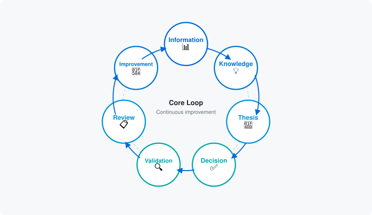
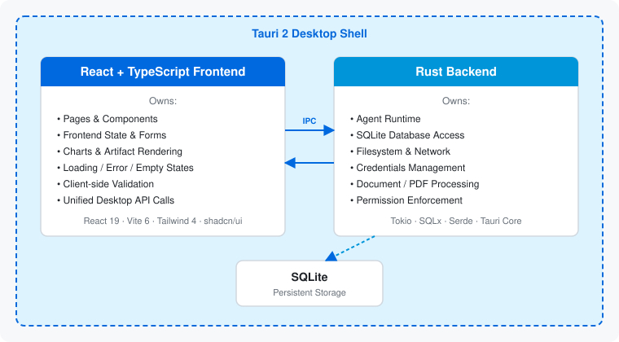
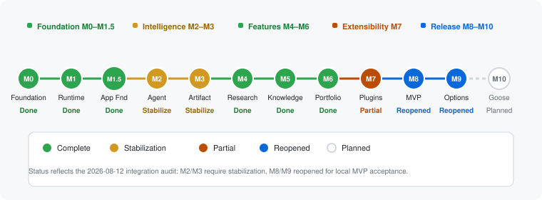

<picture>
  <source media="(prefers-color-scheme: dark)" srcset="assets/header-banner-dark.svg">
  
</picture>

<br>

[](https://www.gnu.org/licenses/agpl-3.0)
[](CONTRIBUTING.md)
[](CHANGELOG.md)
[](https://tauri.app)
[](https://www.rust-lang.org)
[](https://react.dev)

**Desktop-first AI workspace for investment research**

[English](README.md) | [简体中文](README-zh_CN.md) | [日本語](README-ja.md) | [한국어](README-ko.md) | [Español](README-es.md)

---

## What is AlphaForge?

AlphaForge is an **AI-native investment research workspace** designed to transform raw information into structured investment knowledge.

It is **not** a brokerage terminal — it does not execute trades or make autonomous investment decisions. Instead, it provides a structured research workflow that helps you gather information, build evidence-backed theses, make informed decisions, and validate outcomes over time.

### Core Product Loop

<picture>
  <source media="(prefers-color-scheme: dark)" srcset="assets/product-loop-dark.svg">
  
</picture>

AlphaForge helps you:

- **Research efficiently** — AI-assisted document analysis and information gathering
- **Build theses** — Track investment theses with evidence and confidence levels
- **Make informed decisions** — Structured research workflow, not chatbot-style interaction
- **Validate outcomes** — Track thesis performance and learn from results

> **Important**: This is a **research workspace**, not a brokerage terminal. It does NOT execute trades or make autonomous investment decisions.

---

## Table of Contents

- [Status](#status)
- [Features](#features)
- [Tech Stack](#tech-stack)
- [Getting Started](#getting-started)
- [Architecture](#architecture)
- [Documentation](#documentation)
- [Contributing](#contributing)
- [Roadmap](#roadmap)
- [Security](#security)
- [Current Limitations](#current-limitations)
- [License](#license)
- [Acknowledgments](#acknowledgments)

---

## Status

**Current program state (2026-09-20): Core milestones are complete; M11 Portfolio Hardening & Release Candidate is planned.**

The stabilization roadmap (S0-S6), M10 supervised Goose integration, AW0-AW7 managed Agent Worker isolation, and the native macOS GUI overhaul are complete on `dev`. Recent Portfolio work added canonical financial CRUD, thesis-to-asset linkage, market-data refresh, quote caching, and Generic/IBKR activity-statement import. M11 now governs legacy-surface cleanup, large-portfolio performance, release packaging, and cross-platform packaged acceptance. See the [M11 execution plan](docs/milestones/M11_PORTFOLIO_RELEASE_EXECUTION_PLAN.md), [milestone roadmap](docs/MILESTONE_ROADMAP.md), and [architecture document](docs/ARCHITECTURE.md).

| Milestone | Status | Description |
|-----------|--------|-------------|
| M0 | ✅ Complete | Project Foundation |
| M1 | ✅ Complete | Desktop Runtime Foundation |
| M1.5 | ✅ Complete | Application Foundation |
| M2 | ✅ Stabilized (S1) | Agent Runtime & Research Task Execution |
| M3 | ✅ Stabilized (S3) | Artifact Intelligence System & Window Isolation |
| M4 | ✅ Complete | Research Workspace & URL Context Authority |
| M5 | ✅ Complete | Investment Knowledge System |
| M6 | ✅ Complete | Portfolio Intelligence & Wealthfolio Capabilities |
| M7 | ✅ Stabilized (S3) | Internal Plugin Ecosystem & Safe Renderers |
| M8 | ✅ Complete (S6) | Local MVP Completion & Release Readiness |
| M9 | ✅ Complete (S5) | Option Module Integration & Pricing Models |
| M10 | ✅ Complete | Supervised Goose Agent Integration |
| M11 | 📋 Planned | Portfolio Hardening & Release Candidate |

See [MILESTONE_ROADMAP.md](docs/MILESTONE_ROADMAP.md) for detailed milestones.

---

## Features

### Implemented foundation

- Tauri 2 desktop application shell
- React 19 + TypeScript + Vite foundation
- Rust backend with SQLite persistence
- IPC communication layer with strict Zod validation and static registration parity checks
- Comprehensive product, architecture, operations, and contributor documentation
- Agent task lifecycle: creation, background Tokio execution, real-time event streaming (`task:progress`, `task:completed`, etc.), cancellation, failure context, and structured `ResearchCompletion` result rendering
- Real-time event streaming
- Cancellation support
- Artifact persistence layer
- Artifact runtime manager
- Artifact-window routing, isolation, and permission tests
- Research workspace, thesis, knowledge graph, and portfolio workflows
- Validated internal plugin registry, predefined renderers, and Settings management
- Supervised Goose sidecar with read-only MCP scopes, human-approved proposals, and a zero-trading boundary
- Financial Portfolio workflows with thesis linkage, market-data refresh, and Generic/IBKR file import

### Active M11 priorities

- Audit and retire superseded Portfolio runtime paths safely
- Establish and meet approved large-portfolio performance budgets
- Produce reproducible macOS Apple Silicon and Windows NSIS packages
- Retain checksum, SBOM, packaged-smoke, upgrade, security, and release-gate evidence
- Authentication, licensing, payment, cloud backup, and commercial activation remain out of the MVP
- Live broker synchronization and FIRE planning remain deferred pending separate approval

---

## Tech Stack

| Layer | Technology |
|-------|-----------|
| **Desktop Shell** | Tauri 2 |
| **Backend** | Rust, Tokio, SQLx, SQLite |
| **Frontend** | React 19, TypeScript, Vite 6 |
| **UI** | Tailwind CSS 4, shadcn/ui, Radix UI, Lucide |
| **AI** | OpenAI Responses integration and supervised Goose sidecar |
| **Quality** | ESLint, Prettier, Vitest, Rustfmt, Clippy |

---

## Getting Started

### Prerequisites

- **Rust stable** (MSVC toolchain on Windows)
- **Node.js 22+**
- **pnpm 9+**

### Development Commands

```bash
# Install dependencies
pnpm install

# Frontend development
pnpm dev:web          # Start Vite dev server (frontend only)
pnpm typecheck        # TypeScript type check
pnpm lint             # ESLint
pnpm test             # Vitest

# Desktop development (requires Rust)
pnpm tauri dev        # Start full Tauri desktop app
pnpm tauri build      # Production build

# Rust commands (requires Rust)
cargo check --workspace
cargo fmt --check
cargo clippy --all-targets --all-features -- -D warnings
cargo test --workspace
```

---

## Architecture

AlphaForge follows a strict three-layer architecture with clear ownership boundaries.

<picture>
  <source media="(prefers-color-scheme: dark)" srcset="assets/architecture-dark.svg">
  
</picture>

See [`docs/ARCHITECTURE.md`](docs/ARCHITECTURE.md) for full architecture details.

### Key Boundaries

**React** owns:
- Pages, components, and interaction
- Frontend state
- User interface

**Rust** owns:
- Agent runtime
- SQLite database
- Filesystem & network access
- Credentials management

**Tauri** owns:
- Desktop windows
- IPC communication
- Permissions & security
- OS integration

---

## Documentation

### Core Documents

| Document | Purpose |
|----------|---------|
| [AGENTS.md](AGENTS.md) | Agent coding standards (**required reading**) |
| [PRODUCT.md](docs/PRODUCT.md) | Product positioning and MVP scope |
| [VISION.md](docs/VISION.md) | Long-term direction |
| [ARCHITECTURE.md](docs/ARCHITECTURE.md) | System architecture |
| [MILESTONE_ROADMAP.md](docs/MILESTONE_ROADMAP.md) | Product milestones |
| [i18n](docs/i18n/README.md) | Localization architecture and delivery plan |
| [Product experience redesign](docs/PRODUCT_EXPERIENCE_REDESIGN.md) | GUI feedback response, target information architecture, and phased delivery plan |
| [Agent runtime](docs/agent/README.md) | Managed subprocess architecture, roadmap, and implementation checklist |
| [Option module](docs/option/README.md) | Consolidated Option specifications and integration plan |
| [Goose integration](docs/goose/README.md) | Post-MVP Goose boundaries and roadmap |
| [Delivery playbook](docs/milestones/DELIVERY_PLAYBOOK.md) | Milestone execution and evidence rules |
| [Sequential task breakdown](docs/milestones/SEQUENTIAL_TASK_BREAKDOWN.md) | One-task-at-a-time child-agent execution queue |
| [M11 execution plan](docs/milestones/M11_PORTFOLIO_RELEASE_EXECUTION_PLAN.md) | Active Portfolio hardening and release-candidate task queue |

### Technical Documentation

| Document | Purpose |
|----------|---------|
| [AGENT_PROTOCOL.md](docs/AGENT_PROTOCOL.md) | Agent task lifecycle |
| [ADR-0010](docs/DECISIONS/0010-managed-agent-worker-subprocess.md) | Managed Agent worker subprocess decision |
| [ARTIFACT_SYSTEM.md](docs/ARTIFACT_SYSTEM.md) | Artifact rendering |
| [PLUGIN_SPEC.md](docs/PLUGIN_SPEC.md) | Plugin development |
| [DATA_MODEL.md](docs/DATA_MODEL.md) | Entity relationships |
| [SECURITY.md](SECURITY.md) | Security policy |

### Development Guides

| Document | Purpose |
|----------|---------|
| [CONTRIBUTING.md](CONTRIBUTING.md) | Contribution guide |
| [GIT_WORKFLOW.md](docs/GIT_WORKFLOW.md) | Git and PR workflow |
| [PR_BEST_PRACTICES.md](docs/PR_BEST_PRACTICES.md) | PR guidelines |
| [DEVELOPMENT.md](docs/DEVELOPMENT.md) | Local setup guide |

---

## Contributing

We welcome contributions!

### Branch Protection Notice

**Main branch is protected. Direct pushes are BLOCKED.**

All changes must go through Pull Request:
1. Create a feature branch
2. Make changes and commit
3. Create Pull Request
4. Get at least 1 approval
5. Merge to main

See [CONTRIBUTING.md](CONTRIBUTING.md) for detailed workflow.

### Quick Start

1. Read [AGENTS.md](AGENTS.md) (**required**)
2. Check [CONTRIBUTING.md](CONTRIBUTING.md)
3. Fork, create branch, submit PR

All contributions must follow our [Code of Conduct](CODE_OF_CONDUCT.md).

---

## Roadmap

<picture>
  <source media="(prefers-color-scheme: dark)" srcset="assets/roadmap-dark.svg">
  
</picture>

### Phase Overview

**Foundation (M0–M1.5)**: ✅ Complete
- Project setup
- Desktop runtime
- Application foundation

**Intelligence (M2–M3)**: ✅ Stabilized
- Agent execution, managed worker isolation, and least-privilege Artifact windows are integrated

**Features (M4–M6)**: ✅ Complete
- Research workspace, thesis tracking, and portfolio analysis

**Extensibility (M7)**: ✅ Complete within the internal-plugin boundary

**Release and post-MVP (M8–M10)**: ✅ Complete
- Local MVP, Option research, and supervised Goose integration

**Release candidate (M11)**: 📋 Planned
- Portfolio hardening, performance budgets, reproducible packages, and packaged acceptance

See [MILESTONE_ROADMAP.md](docs/MILESTONE_ROADMAP.md) for details.

---

## Security

Security is a top priority. See [SECURITY.md](SECURITY.md) for:
- Vulnerability reporting process
- Security architecture
- Credential management
- Permission model

**Reporting**: Please report security issues privately via GitHub Security.

---

## Current Limitations

1. **No production authentication, billing, or licensing**: These are deliberately deferred from the local MVP.
2. **No cloud backup or automatic updates**: Users control manual local exports and manual downloads.
3. **No macOS notarization in the MVP**: A Gatekeeper warning is a known release risk.
4. **External AI providers require explicit configuration**: Credentials remain outside React and provider use is opt-in.
5. **No live broker synchronization**: Generic and IBKR statement files can be imported, but direct broker connectivity is deferred.

---

## License

This project is licensed under the **GNU Affero General Public License v3.0 (AGPLv3)** — see the [LICENSE](LICENSE) file for details.

### Why AGPLv3?

AGPLv3 ensures that:
- All modifications must be shared back to the community
- Network use (SaaS) triggers copyleft requirements
- Users always have access to the source code
- Commercial use is allowed with proper licensing

This protects the open-source nature of AlphaForge while allowing sustainable development.

---

## Acknowledgments

AlphaForge is made possible by these open source projects:

- [Tauri](https://tauri.app) — Desktop application framework
- [React](https://react.dev) — UI library
- [Rust](https://www.rust-lang.org) — Systems programming language
- [shadcn/ui](https://ui.shadcn.com) — UI components
- [Tailwind CSS](https://tailwindcss.com) — CSS framework

---

## Contact

- **Issues**: [GitHub Issues](https://github.com/BerryUIKI/alpha-forge/issues)
- **Discussions**: [GitHub Discussions](https://github.com/BerryUIKI/alpha-forge/discussions)

---

<p align="center">
  <strong>Built with care by the AlphaForge team</strong>
</p>

<p align="center">
  <sub>Transforming information into investment intelligence</sub>
</p>
